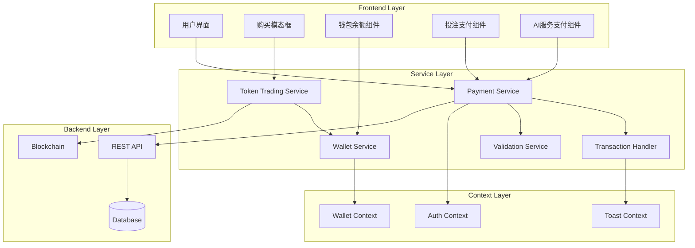

# Design Document: Soul支付系统

## Overview

Soul支付系统是SoulCast平台的核心支付基础设施，扩展现有的ETH购买功能，提供完整的Soul代币购买、管理和支付解决方案。该系统将Soul代币作为平台内的主要支付货币，支持预测市场投注、AI头像生成等各种平台服务的支付。

系统基于现有的代币交易服务(`tokenTradingImproved.ts`)和购买界面(`SoulPurchaseModal.tsx`)，增强支付功能并集成到所有需要支付的平台功能中。

## Architecture

### 系统架构图



### 核心组件关系

1. **Payment Service**: 统一的支付服务，处理所有Soul代币相关的支付操作
2. **Token Trading Service**: 扩展现有服务，增加Soul代币支付功能
3. **Wallet Service**: 管理用户钱包状态和余额
4. **Transaction Handler**: 处理交易逻辑和状态管理
5. **Validation Service**: 验证支付请求和用户权限

## Components and Interfaces

### 1. Enhanced Payment Service

```typescript
interface PaymentService {
  // Soul代币支付
  paySoulTokens(request: SoulPaymentRequest): Promise<PaymentResult>;
  
  // 验证支付能力
  validatePayment(amount: number, userId: string): Promise<ValidationResult>;
  
  // 处理退款
  refundPayment(transactionId: string, reason: string): Promise<RefundResult>;
  
  // 获取支付历史
  getPaymentHistory(userId: string, filters?: PaymentFilters): Promise<PaymentHistory[]>;
}

interface SoulPaymentRequest {
  userId: string;
  amount: number;
  purpose: 'betting' | 'ai_avatar' | 'premium_feature' | 'other';
  marketId?: string;
  serviceId?: string;
  metadata?: Record<string, any>;
}

interface PaymentResult {
  success: boolean;
  transactionId?: string;
  newBalance?: number;
  error?: string;
  requiresConfirmation?: boolean;
}
```

### 2. Enhanced Wallet Service

```typescript
interface WalletService {
  // 获取Soul余额
  getSoulBalance(userId: string): Promise<number>;
  
  // 更新余额显示
  updateBalanceDisplay(userId: string): Promise<void>;
  
  // 同步链上余额
  syncOnChainBalance(userId: string): Promise<void>;
  
  // 余额变化监听
  onBalanceChange(callback: (newBalance: number) => void): void;
}
```

### 3. Betting Payment Integration

```typescript
interface BettingPaymentService {
  // 使用Soul代币投注
  placeBetWithSoul(request: SoulBetRequest): Promise<BetResult>;
  
  // 计算投注费用
  calculateBetCost(amount: number, marketId: string): Promise<BetCostCalculation>;
  
  // 处理获胜奖励
  processWinnings(betId: string, winAmount: number): Promise<void>;
}

interface SoulBetRequest {
  userId: string;
  marketId: string;
  betType: 'YES' | 'NO';
  soulAmount: number;
  maxSlippage?: number;
}
```

### 4. AI Avatar Payment Integration

```typescript
interface AIAvatarPaymentService {
  // AI头像服务定价
  getAvatarServicePricing(): Promise<AvatarPricingTier[]>;
  
  // 购买AI头像服务
  purchaseAvatarService(request: AvatarServiceRequest): Promise<ServicePurchaseResult>;
  
  // 处理服务失败退款
  handleServiceFailure(serviceId: string, userId: string): Promise<void>;
}

interface AvatarPricingTier {
  id: string;
  name: string;
  soulPrice: number;
  features: string[];
  estimatedTime: number;
}
```

## Data Models

### 1. Soul Transaction Model

```typescript
interface SoulTransaction {
  id: string;
  userId: string;
  type: 'purchase' | 'payment' | 'refund' | 'reward';
  amount: number;
  balanceBefore: number;
  balanceAfter: number;
  purpose: string;
  relatedId?: string; // marketId, serviceId等
  status: 'pending' | 'completed' | 'failed' | 'cancelled';
  metadata: {
    paymentMethod?: 'eth' | 'fiat';
    ethAmount?: number;
    ethPrice?: number;
    platformFee?: number;
    gasUsed?: number;
    blockchainTxHash?: string;
  };
  createdAt: Date;
  updatedAt: Date;
}
```

### 2. Payment Configuration Model

```typescript
interface PaymentConfig {
  soulTokenPrice: {
    usd: number;
    eth: number;
    lastUpdated: Date;
  };
  fees: {
    platformFeePercent: number;
    minimumFee: number;
    maximumFee: number;
  };
  limits: {
    minPurchaseUSD: number;
    maxPurchaseUSD: number;
    minPaymentSoul: number;
    maxPaymentSoul: number;
    dailyLimitSoul: number;
  };
  services: {
    betting: {
      enabled: boolean;
      minBetSoul: number;
      maxBetSoul: number;
    };
    aiAvatar: {
      enabled: boolean;
      pricingTiers: AvatarPricingTier[];
    };
  };
}
```

### 3. User Wallet Model

```typescript
interface UserWallet {
  userId: string;
  soulBalance: number;
  lockedSoul: number; // 锁定在待处理交易中的Soul
  totalEarned: number;
  totalSpent: number;
  lastSyncAt: Date;
  preferences: {
    autoSync: boolean;
    lowBalanceAlert: number;
    confirmLargePayments: boolean;
  };
}
```

## Correctness Properties

*A property is a characteristic or behavior that should hold true across all valid executions of a system-essentially, a formal statement about what the system should do. Properties serve as the bridge between human-readable specifications and machine-verifiable correctness guarantees.*

### Property Reflection

在分析了所有需求的可测试性后，我识别出以下需要合并或优化的属性：

**合并的属性：**
- 将余额更新相关的属性（1.4, 2.3, 3.2）合并为一个综合的余额一致性属性
- 将支付验证相关的属性（2.2, 6.1, 6.3）合并为一个支付验证属性
- 将UI显示相关的属性（1.1, 4.1, 5.5, 8.1）合并为界面显示一致性属性
- 将交易记录相关的属性（3.3, 6.4）合并为交易记录完整性属性

**优化后的核心属性：**

### Property 1: 购买计算一致性
*For any* 有效的购买金额和支付方式，计算出的Soul代币数量和手续费应该基于当前汇率和费率配置准确计算
**Validates: Requirements 1.2**

### Property 2: 余额一致性
*For any* 成功的Soul代币交易（购买、支付、退款），用户的余额变化应该准确反映交易金额，并在所有相关界面立即更新
**Validates: Requirements 1.4, 2.3, 3.2**

### Property 3: 支付验证完整性
*For any* 支付请求，系统应该验证用户身份、余额充足性和交易限制，只有通过所有验证的支付才能执行
**Validates: Requirements 2.2, 6.1, 6.3**

### Property 4: 交易原子性
*For any* 支付操作，要么完全成功（扣费并提供服务），要么完全失败（保持原始状态），不存在部分成功的情况
**Validates: Requirements 2.4, 5.4**

### Property 5: 界面显示一致性
*For any* 用户界面状态，显示的Soul代币余额、价格信息和支付选项应该与后端数据保持一致
**Validates: Requirements 1.1, 3.1, 4.1, 5.5, 8.1**

### Property 6: 投注支付集成
*For any* 预测市场投注，Soul代币应该作为可用的支付方式，投注成功后正确扣费并记录
**Validates: Requirements 4.2, 4.3**

### Property 7: 奖励发放准确性
*For any* 获胜的投注，系统应该自动计算并发放正确数量的Soul代币奖励到用户钱包
**Validates: Requirements 4.4**

### Property 8: AI服务支付流程
*For any* AI头像生成请求，系统应该要求Soul代币支付，支付成功后启动服务，失败时退还代币
**Validates: Requirements 5.1, 5.2, 5.3, 5.4**

### Property 9: 异常检测和处理
*For any* 异常交易模式（如频繁大额交易、异常时间交易），系统应该检测并采取适当的安全措施
**Validates: Requirements 6.2**

### Property 10: 交易记录完整性
*For any* Soul代币相关交易，系统应该记录完整的交易详情并在交易历史中正确显示
**Validates: Requirements 3.3, 6.4, 6.5**

### Property 11: 跨设备数据同步
*For any* 用户在不同设备间切换，Soul代币余额和交易历史应该正确同步
**Validates: Requirements 7.2**

### Property 12: 网络容错处理
*For any* 网络连接问题，系统应该提供适当的重试机制和离线缓存，确保交易不丢失
**Validates: Requirements 7.4**

### Property 13: 汇率更新一致性
*For any* Soul代币汇率变化，所有相关的价格显示应该同步更新，保持一致性
**Validates: Requirements 8.2, 8.3**

### Property 14: 价格趋势分析
*For any* 价格历史数据，系统应该提供准确的趋势图表和风险提醒
**Validates: Requirements 8.4, 8.5**

### Property 15: 错误处理和用户指导
*For any* 支付失败或错误情况，系统应该提供清晰的错误信息和解决建议
**Validates: Requirements 1.5**

## Error Handling

### 1. 支付错误分类

```typescript
enum PaymentErrorType {
  INSUFFICIENT_BALANCE = 'insufficient_balance',
  INVALID_AMOUNT = 'invalid_amount',
  USER_NOT_FOUND = 'user_not_found',
  SERVICE_UNAVAILABLE = 'service_unavailable',
  NETWORK_ERROR = 'network_error',
  VALIDATION_FAILED = 'validation_failed',
  TRANSACTION_FAILED = 'transaction_failed',
  RATE_LIMIT_EXCEEDED = 'rate_limit_exceeded'
}

interface PaymentError {
  type: PaymentErrorType;
  message: string;
  details?: Record<string, any>;
  suggestedAction?: string;
  retryable: boolean;
}
```

### 2. 错误恢复策略

- **余额不足**: 引导用户购买更多Soul代币
- **网络错误**: 自动重试机制，最多3次
- **验证失败**: 提供具体的验证错误信息
- **服务不可用**: 显示维护信息和预计恢复时间
- **交易失败**: 回滚状态并记录失败原因

### 3. 用户友好的错误消息

```typescript
const ERROR_MESSAGES = {
  [PaymentErrorType.INSUFFICIENT_BALANCE]: {
    title: '余额不足',
    message: '您的Soul代币余额不足以完成此次支付',
    action: '购买更多Soul代币'
  },
  [PaymentErrorType.NETWORK_ERROR]: {
    title: '网络连接问题',
    message: '请检查您的网络连接并重试',
    action: '重试'
  },
  // ... 其他错误消息
};
```

## Testing Strategy

### 双重测试方法

本系统采用**单元测试**和**基于属性的测试**相结合的综合测试策略：

- **单元测试**: 验证特定示例、边界情况和错误条件
- **属性测试**: 验证跨所有输入的通用属性
- **集成测试**: 验证组件间的交互和端到端流程

### 属性测试配置

使用**fast-check**库进行属性测试，每个属性测试运行最少100次迭代：

```typescript
// 示例属性测试配置
describe('Soul Payment System Properties', () => {
  it('Property 1: Purchase calculation consistency', () => 
    fc.assert(fc.property(
      fc.float({ min: 10, max: 10000 }), // 购买金额
      fc.constantFrom('fiat', 'crypto'), // 支付方式
      async (amount, paymentMethod) => {
        const result = await calculateSoulTokens(amount, paymentMethod);
        // 验证计算结果的一致性
        expect(result.soulAmount).toBeGreaterThan(0);
        expect(result.fee).toBeGreaterThanOrEqual(0);
      }
    ), { numRuns: 100 })
  );
});
```

### 测试标签格式

每个属性测试必须使用以下标签格式引用设计文档属性：
**Feature: soul-payment-system, Property {number}: {property_text}**

### 单元测试重点

- **购买流程**: 测试ETH和法币购买的具体场景
- **支付验证**: 测试各种验证规则和边界条件
- **错误处理**: 测试各种失败场景的处理
- **UI组件**: 测试界面组件的状态和交互
- **API集成**: 测试与后端API的集成点

### 集成测试场景

- **端到端购买流程**: 从选择金额到余额更新的完整流程
- **投注支付集成**: Soul代币投注的完整流程
- **AI服务支付**: AI头像生成的支付和服务流程
- **跨设备同步**: 多设备间的数据同步测试
- **网络故障恢复**: 网络中断和恢复的处理测试